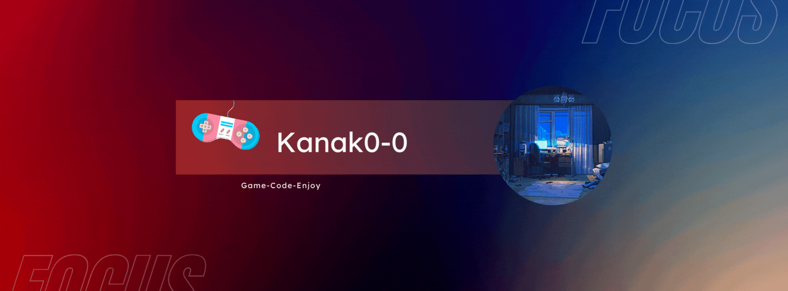

<h1 align="center">Hi 👋, I'm Kanak</h1>
<h3 align="center">A passionate programmer from India</h3>

- 🌱 I’m currently learning **Android development**

- 💬 Ask me about **Java, C++, Unity**

- 📫 How to reach me **kanak007chahal@gmail.com**

- ⚡ Fun fact **Fun loving human interested in everything**

<h3 align="left">Languages and Tools:</h3>

             

